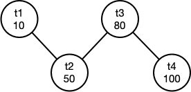

# LAB 4 优化器

## 实验概述

## 实验任务

## 相关模块

## 基础功能实现顺序

## 可选高级功能

不要求将高级功能集成到主分支中，建议单开分支完成实验。但是建议同学们设计验证自己实验结果的测例并给出测试的可视化结果展示。

1. or转union的逻辑优化(1分)：相对简单的逻辑优化过程，在生成执行树过程中将or条件转化为上层union结点，同时实现UnionNode结点并完成转化过程（继承OperNode，用于合并查询结果）。
2. 投影下推的逻辑优化(2分)：将投影算子ProjectNode下推，通过尽早进行投影运算减少算子间的数据传输量。这一操作的主要难点在于提前确定需要投影的列，同时管理何时添加投影算子，以及维护下推后列对应Index的变化。注意，不是所有的投影运算都直接下降到TableScan和Filter,Join之间，有些列要求在Filter,Join后进行投影。例如：select t.a from t where t.b < 1; 需要在TableScan后添加a,b的投影算子，并在Filter之后添加a的投影算子。
3. Join代价估计以及对应的物理优化（3分）：这一功能的正确和完整实现非常困难，建议同学们阅读有关于代价估计的相关教材内容并参考当前经典的数据库系统（PostgreSQL，MySQL等）对应功能实现文档后，仔细思考实现方法和可行性后再进行实验。本实验要求自选一个现有的经典数据库系统，复现其有关于Join代价估计和相关物理优化的简化版本。可以在阅读资料，确定实现明确的实现思路后（一定要思路明确），和助教确认可行性。

同时也鼓励同学们结合相关课程内容提出自己的创新设计。

高级功能满分3分。

## 测试说明

本次实验主要考察多表连接顺序的选择，测试中主要使用了 analyze 和 explain 指令。

测试数据库中共有 4 张表：

```
t1(id int, score float): 共 10 行
t2(id int, score float): 共 50 行
t3(id int, score float, temp float): 共 100 行
t4(id int, score float): 共 100 行
```

id 列为单调递增序列。

score 列为均匀随机值，范围 [0, 100]。

temp 列为均匀随机值，范围 [35, 38]。

score 列和 temp 列分布独立。

analyze 指令用于生成直方图，计算当前数据库所有表的数值型列的统计信息，保存至 StatsManager 的 stats\_map\_ 中。**统计信息只要求保存至内存，无需持久化到磁盘。**

explain 指令用于打印查询计划树节点，本次实验主要涉及投影节点（Project Node）、连接节点（Join Node）、选择节点（Filter Node）、扫描节点（Table Scan Node）。

根据节点高度不同，打印节点前会先打印一定数量的'\t'，高度相同的节点打印的'\t'数量相同。

例如，对于以下 SQL 语句：

```sql
explain select t2.id from t1, t2, t3 where t3.id = t1.id and t3.id = t2.id and t3.score < 30.0 and t3.temp < 36.0;
```

一种可能的查询计划树如下：


该计划树打印后如下所示：

```
Select:
	Project Node:
		Join Node:
			Join Node:
				Filter Node:
					Table Scan Node(t3):
				Table Scan Node(t1):
			Table Scan Node(t2):
```

本次实验主要关注连接顺序的选择，对测试数据的每条 SQL 语句，需确保优化器选择了正确的连接顺序。对于以上示例，需确保表 t3 和 t1 先连接，其次再和表 t2 连接。

对于同一树高的左右节点顺序没有要求，因此以下几个查询计划树都可以通过测试：

```
Select:
	Project Node:
		Join Node:
			Table Scan Node(t2):
			Join Node:
				Filter Node:
					Table Scan Node(t3):
				Table Scan Node(t1):
```

```
Select:
	Project Node:
		Join Node:
			Table Scan Node(t2):
			Join Node:
				Table Scan Node(t1):
				Filter Node:
					Table Scan Node(t3):
```

此外，在连接顺序重排的过程中，需要确保两表之间存在连接条件，如对于 SQL

```
explain select t2.id from t1, t2, t3, t4 where t3.score < 80.0 and t4.id = t1.id and t4.id2 = t2.id2 and t4.id = t3.id;
```

虽然 t1 和 t2 是基数最小的两个表，但由于 t1 和 t2 之间没有连接条件，所以不能将 t1 和 t2 优先连接。

## 连接顺序优化示例

下面，结合一个简单的示例来解释连接顺序的优化过程。此处以30测例中第一条查询语句为例：

```sql
explain select t2.id from t1, t2, t3, t4 where t3.score < 80.0 and t4.id = t3.id and t3.id = t2.id and t2.id = t1.id;
```

经过代价估计过程，可以得出各个表对应的执行树算子代价分别为：

|表名|代价|
|:---:|:---:|
|t1|10|
|t2|50|
|t3|80|
|t4|100|

此时，我们以表作为结点，连接关系作为边，可以生成一张无向的连接图。



考虑到join代价估计非常困难，所以基础功能直接使用了一种非常简单的启发式算法，从最小代价结点出发依次添加相邻最小代价结点的贪心过程。

实际执行过程如下：
1. 首先，选择最小代价结点t1，此时邻接结点集合为{t2}，已连接结点集合为{t1}
2. 当邻接结点集合不为空时，从邻接结点结合取出最小代价结点添加到已连接结点集合，本步骤即为取出t2，此时邻接结点集合为{}，已连接结点集合为{t1,t2}。
3. 将新添加结点的所有不在已连接集合的邻接结点加入到邻接结点集合，本步骤将添加t3，此时邻接结点集合为{t3}。
4. 重复2,3直至邻接结点集合为空。
5. 注意，每次步骤2取出新节点时，新的结点和已经完成连接的部分存在且仅存在1条连接关系（不考虑多列连接的必然结果），每次执行步骤2时按顺序记录这条连接关系，取出{t2}时连接顺序为{t1.t2}，取出t3时连接顺序为{t1.t2, t2.t3}...。
6. 在步骤4执行完成时，最终连接顺序确定为{t1.t2, t2.t3, t3.t4}。之后只需要修改LAB3中生成执行计划树的顺序即可。
此外，在连接顺序重排的过程中，需要确保两表之间存在连接条件，如对于 SQL

## 截止时间

2022年5月8日（第十一周周日）晚23:59分。


