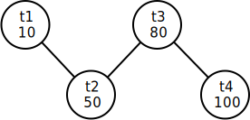
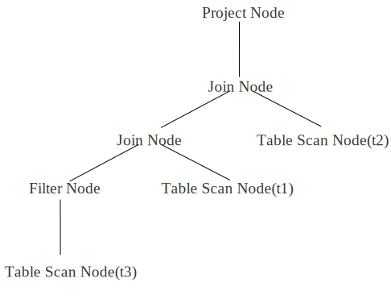

# LAB 4 优化器

## 实验概述

本次实验主要关注于数据库系统的查询计划优化过程，重点关注于逻辑优化中的连接顺序选择。通过实现简单的基数估计算法和连接顺序选择算法，让同学们对于数据库系统中逻辑优化的过程有更进一步的理解。

## 实验任务

本次实验主要有3个任务：
1. 实现直方图的数据结构。
2. 补全Filter算子的基数估计过程。
3. 完成Optimizer中连接顺序优化过程。

实验开始前，请按照文档中[更新说明](https://thu-db.github.io/dbtrain-tutorial/intro.html#%E6%9B%B4%E6%96%B0%E8%AF%B4%E6%98%8E)中的步骤合并新增代码。

为加快 CI 评测速度，本次实验通过定义 SKIP_LOG 宏关闭了日志功能，代码更新后可能无法通过 lab 2 测试，但应仍能正确通过 lab 1 和 lab 3 测试。

## 相关模块

1. utils/graph: 实现了基于邻接表的无向图
2. optim/stats_manager: 用于管理统计信息，包括直方图的存储

## 基础功能实现顺序

1. utils/histogram.cpp: 补全直方图的构建和估计函数。
2. optim/stats_manager.cpp: 补全读取表的数据并构建直方图的过程。
3. oper/basic_node.cpp: 补全Filter算子的基数估计过程。
4. optim/optim.cpp: 完成Optimizer中连接顺序优化过程。

## 连接顺序优化示例

下面，结合一个简单的示例来解释连接顺序的优化过程。此处以30测例中第一条查询语句为例：

```sql
explain select t2.id from t1, t2, t3, t4 where t3.score < 80.0 and t4.id = t3.id and t3.id = t2.id and t2.id = t1.id;
```

经过基数估计过程，可以得出各个表对应的执行树算子基数分别约为：

|表名|基数|
|:---:|:---:|
|t1|10|
|t2|50|
|t3|约80|
|t4|100|

此时，我们以表作为结点，连接关系作为边，可以生成一张无向的连接图。



考虑到join基数估计较为困难，所以基础功能只需使用一种非常简单的启发式算法，从最小基数结点出发依次添加相邻最小基数结点的贪心过程。

实际执行过程如下：
1. 首先，选择最小基数结点t1，此时邻接结点集合为{t2}，已连接结点集合为{t1}
2. 当邻接结点集合不为空时，从邻接结点结合取出最小基数结点添加到已连接结点集合，本步骤即为取出t2，此时邻接结点集合为{}，已连接结点集合为{t1,t2}。
3. 将新添加结点的所有不在已连接集合的邻接结点加入到邻接结点集合，本步骤将添加t3，此时邻接结点集合为{t3}。
4. 重复2,3直至邻接结点集合为空。
5. 注意，每次步骤2取出新节点时，新的结点和已经完成连接的部分存在且仅存在1条连接关系（不考虑多列连接的必然结果），每次执行步骤2时按顺序记录这条连接关系，取出{t2}时连接顺序为{t1.t2}，取出t3时连接顺序为{t1.t2, t2.t3}...。
6. 在步骤4执行完成时，最终连接顺序确定为{t1.t2, t2.t3, t3.t4}。之后只需要修改LAB3中生成执行计划树的顺序即可。

## 测试说明

本次实验主要考察多表连接顺序的选择，测试中主要使用了 analyze 和 explain 指令。

analyze 指令用于生成直方图，计算当前数据库所有表的数值型列的统计信息，保存至 StatsManager 的 stats\_map\_ 中。**统计信息只要求保存至内存，无需持久化到磁盘。**

explain 指令用于打印查询计划树节点，本次实验主要涉及投影节点（Project Node）、连接节点（Join Node）、选择节点（Filter Node）和扫描节点（Table Scan Node）。

测试数据库中共有 4 张表：

```
t1(id int, score float): 共 10 行
t2(id int, id2 int, score float): 共 50 行
t3(id int, score float, temp float): 共 100 行
t4(id int, id2 int, score float): 共 100 行
```

id 列为从 1 开始的递增序列。

id2 列为从 2 开始的递减序列。

score 列为均匀随机值，范围 [0, 100]。

temp 列为均匀随机值，范围 [35, 38]。

score 列和 temp 列分布独立。

根据节点高度不同，打印节点前会先打印一定数量的'\t'，高度相同的节点打印的'\t'数量相同。

例如，对于以下 SQL 语句：

```sql
explain select t2.id from t1, t2, t3 where t3.id = t1.id and t3.id = t2.id and t3.score < 30.0 and t3.temp < 36.0;
```

一种可能的查询计划树如下：



该计划树打印后如下所示：

```
Select:
	Project Node:
		Join Node:
			Join Node:
				Filter Node:
					Table Scan Node(t3):
				Table Scan Node(t1):
			Table Scan Node(t2):
```

本次实验主要关注连接顺序的选择，对测试数据的每条 SQL 语句，需确保优化器选择了正确的连接顺序。对于以上示例，需确保表 t3 和 t1 先连接，其次再和表 t2 连接。

对于同一树高的左右节点顺序没有要求，因此以下几个查询计划树都可以通过测试：

```
Select:
	Project Node:
		Join Node:
			Table Scan Node(t2):
			Join Node:
				Filter Node:
					Table Scan Node(t3):
				Table Scan Node(t1):
```

```
Select:
	Project Node:
		Join Node:
			Table Scan Node(t2):
			Join Node:
				Table Scan Node(t1):
				Filter Node:
					Table Scan Node(t3):
```

此外，在连接顺序重排的过程中，需要确保两表之间存在连接条件，如对于 SQL

```
explain select t2.id from t1, t2, t3, t4 where t3.score < 80.0 and t4.id = t1.id and t4.id2 = t2.id2 and t4.id = t3.id;
```

虽然 t1 和 t2 是基数最小的两个表，但由于 t1 和 t2 之间没有连接条件，所以不能将 t1 和 t2 优先连接。

## 可选高级功能

不要求将高级功能集成到主分支中，建议单开分支完成实验。但是建议同学们设计验证自己实验结果的测例并给出测试的可视化结果展示。

1. or转union的逻辑优化(1分)：在生成计划树过程中将or条件转化为上层union结点，需要实现UnionNode结点并完成转化过程（继承OperNode，用于合并查询结果）。
2. 投影下推的逻辑优化(2分)：将投影算子ProjectNode下推，通过尽早进行投影运算减少算子间的数据传输量。这一操作的主要难点在于提前确定需要投影的列，同时管理何时添加投影算子，以及维护下推后列对应Index的变化。注意，不是所有的投影运算都直接下降到TableScan和Filter,Join之间，有些列要求在Filter,Join后进行投影。例如：select t.a from t where t.b < 1; 需要在TableScan后添加a,b的投影算子，并在Filter之后添加a的投影算子。
3. **[挑战性项目]** Join基数估计以及对应的逻辑优化（3分）：这一功能的正确和完整实现较为困难，建议同学们阅读有关于基数估计的相关教材内容并参考当前经典的数据库系统（PostgreSQL，MySQL等）对应功能实现文档后，仔细思考实现方法和可行性后再确定是否进行该实验。本实验要求自选一个现有的经典数据库系统，复现其有关于Join基数估计和相关逻辑优化的简化版本。

同时也鼓励同学们结合相关课程内容提出自己的创新设计。注意，挑战性项目难度较高，工作量较大，仅建议对数据库系统查询优化感兴趣的同学进行挑战。

高级功能满分3分。

## 截止时间

2022年5月8日（第十一周周日）晚23:59分。


